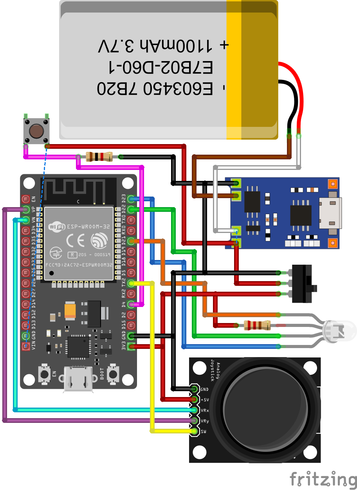

# ESP32 Joystick Controller for ROS2 Bridge

[](https://platformio.org/)
[](https://www.espressif.com/en/products/socs/esp32)
[](https://docs.ros.org/en/humble/)
[](https://socket.io/)

A wireless joystick controller implementation for ESP32 using PlatformIO that enables real-time robot control through Socket.IO communication with a ROS2 delivery bridge system. Control your robot wirelessly with an analog joystick connected to ESP32, featuring variable speed control, RGB LED status indication, and seamless ROS2 integration.

## Features

- **Wireless Joystick Control** - Real-time robot control with analog joystick
- **Variable Speed Control** - Two-speed operation (half/full speed) based on joystick position
- **Real-time Socket.IO Communication** - Low-latency communication between ESP32 and ROS2
- **PlatformIO Integration** - Professional development environment with easy deployment
- **Plug-and-Play Hardware** - Simple joystick wiring to ESP32 GPIO pins
- **Event-driven Architecture** - Responsive callbacks for connection status monitoring
- **cmd_vel Command Transmission** - Direct robot movement control via ROS2 standard
- **Automatic Reconnection Logic** - Robust connection handling
- **JSON-based Protocol** - Standardized message format
- **Delivery Bridge Integration** - Seamless ROS2 robot communication
- **No Authentication Required** - Direct API access for embedded devices
- **RGB LED Status Indicator** - Visual feedback for system states and connection status
- **Real-time Robot Data** - Battery status, position updates, system status

## Table of Contents

- [Requirements](#requirements)
- [Quick Start](#quick-start)
- [Installation](#installation)
- [Configuration](#configuration)
- [Usage](#usage)
- [Project Structure](#project-structure)
- [API Reference](#api-reference)
- [Contributing](#contributing)

## Requirements

### Hardware
- **ESP32 Development Board** (ESP32 DevKitC, NodeMCU-32S, or compatible)
- **Analog Joystick Module** (2-axis with VRX/VRY outputs)
- **Common Anode RGB LED** (or individual LEDs with current-limiting resistors)
- **Jumper Wires** (male-to-female for connections)
- **USB Cable** (micro-USB or USB-C depending on your board)
- **Computer** with available USB port
- **Robot** compatible with ROS2 cmd_vel commands (optional for testing)



#### Joystick Wiring
```
Joystick Module → ESP32
VCC → 3.3V
GND → GND
VRX → GPIO39 (ADC3)
VRY → GPIO36 (ADC0)
```

#### Pushbutton Wiring
```
Pushbutton (Dead Man Switch) → ESP32
One side → GPIO4
Other side → GND
```

#### RGB LED Wiring (Common Anode)
```
RGB LED → ESP32
Red Cathode → GPIO25 (with 220Ω resistor)
Common Anode → 3.3V
Green Cathode → GPIO26 (with 220Ω resistor)
Blue Cathode → GPIO27 (with 220Ω resistor)
```

### Software
- **Visual Studio Code** (recommended) or any text editor
- **PlatformIO IDE** extension for VS Code
- **ROS2** (Humble or newer) for the delivery bridge
- **Python 3.8+** for the delivery bridge server
- **Git** for cloning repositories

## Quick Start

1. **Clone this repository**
   ```bash
   cd ~/colcon_ws/src
   git clone https://github.com/TheBIGduke/Joystick-Wireless-Control-for-ROS2.git
   cd Joystick-Wireless-Control-for-ROS2/delivery_bridge
   pip install -r requirements.txt
   ```

2. **Build and test the delivery bridge**
   ```bash
   cd ~/colcon_ws/
   colcon build --packages-select delivery_bridge --symlink-install --allow-overriding delivery_bridge
   source install/setup.bash
   ros2 run delivery_bridge server_node
   ```

3. **Wire the joystick** to ESP32 according to the wiring diagram

4. **Configure WiFi and server settings** in `Joystick_SocketIO_ESP32/src/main.cpp`

5. **Upload to ESP32** using PlatformIO

6. **Test joystick control** - Move joystick to control robot wirelessly

## Installation

### Step 1: Install Development Environment

#### Option A: Visual Studio Code + PlatformIO (Recommended)

1. **Download and install [Visual Studio Code](https://code.visualstudio.com/)**

2. **Install PlatformIO IDE extension:**
   - Open VS Code
   - Go to Extensions (`Ctrl+Shift+X` / `Cmd+Shift+X`)
   - Search for "PlatformIO IDE"
   - Click "Install"
   - Restart VS Code when prompted

#### Option B: PlatformIO Core CLI

```bash
# Install PlatformIO Core
pip install platformio

# Verify installation
pio --version
```

### Step 2: Setup ROS2 Delivery Bridge

**Prerequisites:** ROS2 Humble or newer installed on your system. Follow [ROS2 installation guide](https://docs.ros.org/en/humble/Installation.html) if needed.

1. **Clone this repository:**
   ```bash
   cd ~/colcon_ws/src
   git clone https://github.com/TheBIGduke/Joystick-Wireless-Control-for-ROS2.git
   cd Joystick-Wireless-Control-for-ROS2
   ```

2. **Install Python dependencies:**
   ```bash
   cd delivery_bridge
   pip install -r requirements.txt
   ```

3. **Build the ROS2 package:**
   ```bash
   cd ~/colcon_ws/
   colcon build --packages-select delivery_bridge --symlink-install --allow-overriding delivery_bridge
   source install/setup.bash
   ```

4. **Test the delivery bridge:**
   ```bash
   ros2 run delivery_bridge server_node
   ```
   
   Expected output:
   ```
   [INFO] [server_node]: Starting node BaseNode ...
   [INFO] [server_node]: Database created successfully.
   [INFO] [server_node]: FunctionManager thread started
   INFO: Uvicorn running on http://0.0.0.0:9009
   INFO: connection open
   ```

5. **Verify the server:**
   - Server listening on port 9009: 
   - API documentation: `http://127.0.0.1:9009/docs` 
   - Socket.IO ready for ESP32 connections 

### Step 3: Setup ESP32 Project

1. **Navigate to ESP32 project:**
   ```bash
   cd ~/colcon_ws/src/Joystick-Wireless-Control-for-ROS2/Joystick_SocketIO_ESP32
   ```

2. **Open in VS Code:**
   - Launch VS Code
   - File → Open Folder
   - Select the `Joystick-Wireless-Control-for-ROS2` directory

3. **Wait for PlatformIO to initialize:**
   - PlatformIO will automatically detect the project
   - Dependencies will be installed automatically
   - Check the PlatformIO terminal for completion

## Configuration

### Joystick Configuration

#### Hardware Wiring
Connect your analog joystick module to ESP32:

```
Joystick Pin → ESP32 Pin
VCC         → 3.3V
GND         → GND  
VRX         → GPIO39 (ADC3)
VRY         → GPIO36 (ADC0)
```

#### Software Configuration
Edit `Joystick_SocketIO_ESP32/src/main.cpp` to configure joystick and WiFi settings:

```cpp
// Joystick pins
#define VRX_PIN  39 // ESP32 pin GPIO39 (ADC3) connected to VRX pin
#define VRY_PIN  36 // ESP32 pin GPIO36 (ADC0) connected to VRY pin

// Joystick calibration values (adjust based on your joystick)
#define CENTER_X 1945
#define CENTER_Y 2005
#define MAX_X    4095
#define MAX_Y    4095

// Movement parameters
const float LINEAR_SPEED_FULL = 0.4;   // Full linear velocity (m/s)
const float LINEAR_SPEED_HALF = 0.2;   // Half linear velocity (m/s)
const float ANGULAR_SPEED_FULL = 0.6;  // Full angular velocity (rad/s)
const float ANGULAR_SPEED_HALF = 0.3;  // Half angular velocity (rad/s)

// Speed threshold for variable speed control
const int SPEED_THRESHOLD = 250;  // Threshold for half vs full speed

// WiFi credentials
const char* ssid = "ESP32";
const char* password = "12345678";
```

### Socket.IO Server Configuration

1. **Find your computer's IP address (where delivery_bridge is running):**

   **Windows:**
   ```cmd
   ipconfig
   ```
   
   **macOS/Linux:**
   ```bash
   ifconfig
   # or
   ip addr show
   ```

2. **Update the server address in `Joystick_SocketIO_ESP32/src/main.cpp`:**
   ```cpp
   // Socket.IO server (replace with your computer's IP where ROS2 robot is running)
   const char* socketio_host = "192.168.0.103";
   const int socketio_port = 9009;
   ```
   Replace `192.168.0.103` with your computer's IP address.

### Advanced Configuration

#### Joystick Calibration
To calibrate your joystick for optimal performance:

1. **Find center values**: Upload the code and observe joystick readings at rest
2. **Find max values**: Move joystick to extremes and note maximum readings
3. **Update calibration constants** in `main.cpp`:

```cpp
// Update these based on your joystick readings
#define CENTER_X 1945  // X-axis center value
#define CENTER_Y 2005  // Y-axis center value
#define MAX_X    4095  // Maximum X reading
#define MAX_Y    4095  // Maximum Y reading
```

#### Speed Tuning
Adjust robot speeds and control sensitivity:

```cpp
// Control sensitivity
const int deadzone = 4;           // Joystick deadzone
const int SPEED_THRESHOLD = 250;  // Half/full speed threshold

// Movement speeds
const float LINEAR_SPEED_FULL = 0.4;   // Maximum forward/backward speed
const float ANGULAR_SPEED_FULL = 0.6;  // Maximum rotation speed

// Communication settings
const unsigned long CMD_VEL_INTERVAL = 100; // Command sending interval (ms)
```

## Usage

### 1. Start the ROS2 Delivery Bridge

First, ensure your delivery bridge is running:

```bash
# Navigate to your ROS2 workspace
cd ~/colcon_ws

# Source ROS2 environment
source /opt/ros/humble/setup.bash
source install/setup.bash

# Start the delivery bridge server
ros2 run delivery_bridge server_node
```

Expected output:
```
[INFO] [server_node]: Starting node BaseNode ...
[INFO] [server_node]: Database created successfully.
[INFO] [server_node]: FunctionManager thread started
INFO: Uvicorn running on http://0.0.0.0:9009
INFO: connection open
```

### 2. Upload Code to ESP32

#### Using VS Code + PlatformIO:
1. Connect ESP32 via USB
2. Open the `Joystick_SocketIO_ESP32` folder in VS Code
3. Click PlatformIO icon in sidebar
4. Project Tasks → esp32doit-devkit-v1 → General → Upload
5. Monitor progress in terminal

#### Using PlatformIO CLI:
```bash
# Navigate to Joystick_SocketIO_ESP32 directory
cd Joystick_SocketIO_ESP32

# Build the project
pio run

# Upload to device
pio run -t upload

# Monitor serial output
pio device monitor -b 9600
```

### 3. Monitor Communication

#### Serial Monitor (ESP32):
```bash
# From Joystick_SocketIO_ESP32 directory
pio device monitor -b 9600
```

Expected ESP32 output:
```
Connecting to WiFi...
Connected to WiFi
IP address: 192.168.0.101
[IOc] Connected to url: /socket.io/?EIO=4
=== Joystick Wireless Control for ROS2 Started ===
Joystick Controls with Variable Speed:
- Y-axis: Forward/Backward movement
- X-axis: Left/Right rotation
- Speed: Half speed for |value| <= 250, Full speed for |value| > 250
Joystick - x = 0, y = 0
Movement: STOPPED | linear_x=0.00, angular_z=0.00
Joystick - x = 150, y = 300
Movement: COMBINED_MOVEMENT | linear_x=0.20, angular_z=-0.30
```

#### Delivery Bridge Console:
Check the delivery bridge server logs for incoming Socket.IO connections and cmd_vel commands.

## Project Structure

```
Joystick-Wireless-Control-for-ROS2/
├── Joystick_SocketIO_ESP32/
│   ├── src/
│   │   └── main.cpp                 # ESP32 Socket.IO client code
│   ├── include/                     # (empty directory)
│   ├── lib/                         # (empty directory)
│   ├── platformio.ini               # PlatformIO configuration
│   └── .vscode/
│       └── extensions.json          # VS Code extensions
├── delivery_bridge/
│   ├── delivery_bridge/
│   │   ├── __init__.py
│   │   ├── base_node.py
│   │   ├── server_node.py
│   │   └── modules/                 # ROS2 functionality modules
│   ├── package.xml                  # ROS2 package configuration
│   ├── setup.py                     # Python package setup
│   └── requirements.txt             # Python dependencies
├── src/                             # (empty directory)
├── .gitignore                       # Git ignore file
└── README.md                        # This file
```

## API Reference

### ESP32 Client Functions

The main code uses the SocketIOclient library with these key components:

```cpp
// Socket.IO client instance
SocketIOclient socketIO;

// Read joystick values
void readJoystick() {
  valueX = analogRead(VRY_PIN);
  valueY = analogRead(VRX_PIN);
  // Apply mapping and deadzone filtering
}

// Calculate variable speeds based on joystick position
float calculateLinearSpeed(int joystickValue) {
  int absValue = abs(joystickValue);
  if (absValue <= SPEED_THRESHOLD) {
    return (joystickValue > 0) ? LINEAR_SPEED_HALF : -LINEAR_SPEED_HALF;
  } else {
    return (joystickValue > 0) ? LINEAR_SPEED_FULL : -LINEAR_SPEED_FULL;
  }
}

// Connection
socketIO.begin(socketio_host, socketio_port, "/socket.io/?EIO=4");

// Event handler
socketIO.onEvent(socketIOEvent);

// Send cmd_vel event based on joystick input
String payload = "[\"cmd_vel\",{\"linear_x\":" + String(linear_x) + ",\"angular_z\":" + String(angular_z) + "}]";
socketIO.sendEVENT(payload);

// Poll for messages
socketIO.loop();
```

### Delivery Bridge API

The delivery bridge provides these endpoints:

#### HTTP REST API
```cpp
// Robot control
POST /ros/functionality_mode/     // Set robot mode
{"mode": "delivery"}

// Navigation
GET  /waypoints/waypoint         // Get available waypoints
POST /navigation/set_goal/{id}   // Navigate to waypoint
POST /navigation/set_wp/pause    // Pause navigation
POST /navigation/set_wp/resume   // Resume navigation
POST /navigation/set_wp/stop     // Stop navigation
```

#### Socket.IO Events
```cpp
// Outgoing (ESP32 → Server)
["cmd_vel", {"linear_x": 0.2, "angular_z": 0.1}]  // Robot movement

// Incoming (Server → ESP32)
["battery", {"voltage": 12.5, "percentage": 85.2}]     // Battery status
["robot_pose", {"position_x": 1.2, "position_y": 3.4, "orientation": 0.5}]  // Position
["on_status_change", {"general": {"ready": true}}]     // System status
```

### Socket.IO Events

| Event | Description |
|-------|-------------|
| `sIOtype_CONNECT` | Successfully connected to server |
| `sIOtype_DISCONNECT` | Disconnected from server |
| `sIOtype_EVENT` | Received event from server |
| `sIOtype_ACK` | Received acknowledgment |
| `sIOtype_ERROR` | Connection or protocol error |

### cmd_vel Message Format

The ESP32 sends cmd_vel commands in this JSON format:

```json
[
  "cmd_vel",
  {
    "linear_x": 0.2,
    "angular_z": 0.1
  }
]
```

Where:
- `linear_x`: Forward/backward velocity (m/s) - controlled by joystick Y-axis
- `angular_z`: Rotational velocity (rad/s) - controlled by joystick X-axis

#### Variable Speed Control
- **Half Speed**: When `|joystick_value| ≤ SPEED_THRESHOLD` (gentle movements)
- **Full Speed**: When `|joystick_value| > SPEED_THRESHOLD` (extreme positions)
- **Stopped**: When joystick is in center position (within deadzone)

## RGB LED Status Reference

| LED State | Color | Blink Pattern | Description |
|-----------|-------|---------------|-------------|
| Calibrating | Orange | Fast blink | Initial calibration in progress |
| WiFi Connecting | Blue | Medium blink | Attempting to connect to WiFi |
| WiFi Connected | Blue | Solid | Successfully connected to WiFi |
| Socket.IO Connecting | Yellow | Fast blink | Connecting to Socket.IO server |
| Socket.IO Connected | Yellow | Solid | Successfully connected to Socket.IO |
| System Online | Green | Solid | System ready, waiting for input |
| Dead Man (No Input) | Magenta | Slow pulse | Dead man switch active, no joystick input |
| Dead Man (With Input) | Magenta | Rapid pulse | Dead man active with joystick input |
| Error | Red | Triple blink | Connection error or system fault |

## Troubleshooting

### Common Issues

#### Joystick Not Responding
**Symptoms:** Robot doesn't move when joystick is moved
- **Check wiring**: Verify VRX→GPIO39, VRY→GPIO36, VCC→3.3V, GND→GND
- **Check power**: Ensure joystick module receives 3.3V power
- **Calibrate joystick**: Update CENTER_X, CENTER_Y values in code
- **Check serial output**: Monitor joystick readings for proper values
- **Verify deadzone**: Adjust deadzone value if joystick is too sensitive

#### ESP32 Won't Connect to WiFi
**Symptoms:** ESP32 continuously attempts WiFi connection
- Verify WiFi credentials in `Joystick_SocketIO_ESP32/src/main.cpp`
- Ensure WiFi network is 2.4GHz (ESP32 doesn't support 5GHz)
- Check ESP32 is within range of router
- Try different WiFi network for testing

#### Socket.IO Connection Failed
**Symptoms:** WiFi connected but Socket.IO connection fails
- Verify delivery bridge server is running and accessible
- Check server IP address and port in ESP32 code
- Ensure both devices are on same network
- Confirm delivery bridge is listening on port 9009
- Test server accessibility: `telnet YOUR_IP 9009`

#### Upload/Build Errors
**Symptoms:** PlatformIO compilation or upload errors
```bash
# Clean and rebuild
pio run -t clean
pio run

# Update PlatformIO
pio upgrade --dev

# Check device connection
pio device list
```

#### Serial Monitor Shows Nothing
**Symptoms:** No output in serial monitor
- Verify baud rate (9600 - as set in the code)
- Check USB cable and connection
- Try different USB port
- Press ESP32 reset button
- Verify correct COM port selection

#### Joystick Control Issues
**Symptoms:** Joystick moves but robot responds incorrectly
- **Speed too fast/slow**: Adjust LINEAR_SPEED_FULL/HALF and ANGULAR_SPEED_FULL/HALF
- **Wrong direction**: Check joystick wiring (swap VRX/VRY if needed)
- **Erratic movement**: Increase deadzone value or recalibrate center values
- **No variable speed**: Verify SPEED_THRESHOLD value is appropriate
- **Joystick drift**: Recalibrate CENTER_X and CENTER_Y values

#### Delivery Bridge Issues
**Symptoms:** ESP32 connects but robot doesn't move
- Verify delivery bridge ROS2 setup is complete
- Check ROS2 nodes are running properly: `ros2 topic list`
- Confirm cmd_vel topic is being published: `ros2 topic echo /cmd_vel`
- Test Socket.IO connection: Check server logs for "connection open"
- Verify API endpoints: Visit `http://YOUR_IP:9009/docs`
- Check delivery bridge logs for received Socket.IO events

### Performance Optimization

For better joystick control performance:
- **Reduce latency**: Decrease CMD_VEL_INTERVAL (currently 100ms)
- **Improve WiFi**: Increase TX power with `WiFi.setTxPower(WIFI_POWER_19_5dBm)`
- **Fine-tune speeds**: Adjust speed constants for your robot's capabilities
- **Optimize deadzone**: Set appropriate deadzone to prevent drift
- **Calibrate precisely**: Use actual joystick readings for CENTER and MAX values
- **Reduce serial output**: Comment out debug prints for faster operation

## Contributing

We welcome contributions!

### Development Setup
1. Fork the repository
2. Create a feature branch
3. Make your changes
4. Test with actual delivery bridge setup
5. Submit a pull request

### Acknowledgments

This project builds upon the excellent work of the [delivery_bridge](https://github.com/cmauricioae8/delivery_bridge) ROS2 package created by **C. Mauricio Arteaga-Escamilla** ([@cmauricioae8](https://github.com/cmauricioae8)).

**Original Author Credits:**
- **Author:** C. Mauricio Arteaga-Escamilla
- **GitHub:** [@cmauricioae8](https://github.com/cmauricioae8)
- **Repository:** [delivery_bridge](https://github.com/cmauricioae8/delivery_bridge)
- **Location:** Mexico
- **Email:** cmauricioae8@gmail.com

**ESP32 Joystick Controller Implementation:**
- **Author:** Kaléin Tamaríz - TheBIGduke
- **Version:** 2.0.0

---

**Made with care for the ESP32 and ROS2 community**
